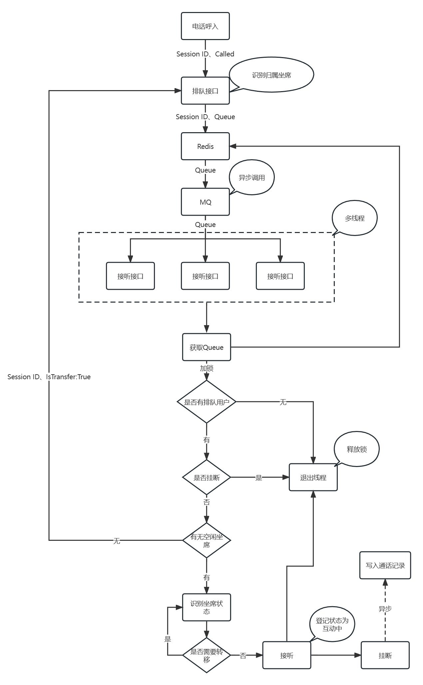

# 电话呼入Demo

## 项目流程图

## 参数信息

| 参数名称       | 参数类型 | 参数含义   | 说明               |
|------------|------|--------|------------------|
| Session Id | 字符串  | 呼叫唯一ID | 后续请求需要此参数        |
| Queue      | 字符串  | 队列名称   | 后续请求需要此参数        |
| Caller     | 字符串  | 主叫号码   | 
| Called     | 字符串  | 被叫号码   | 
| Status     | 整型   | 坐席状态   | 0下线、1空闲、2互动中 默认0 |
| IsTransfer | 整型   | 是否转移   | 0不转移、1转移 默认0     |

## 技术选型
- Spring Boot
- Mysql
- Mybatis-Plus
- Redis
- Kafka